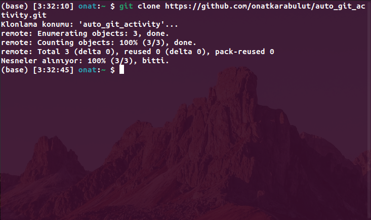
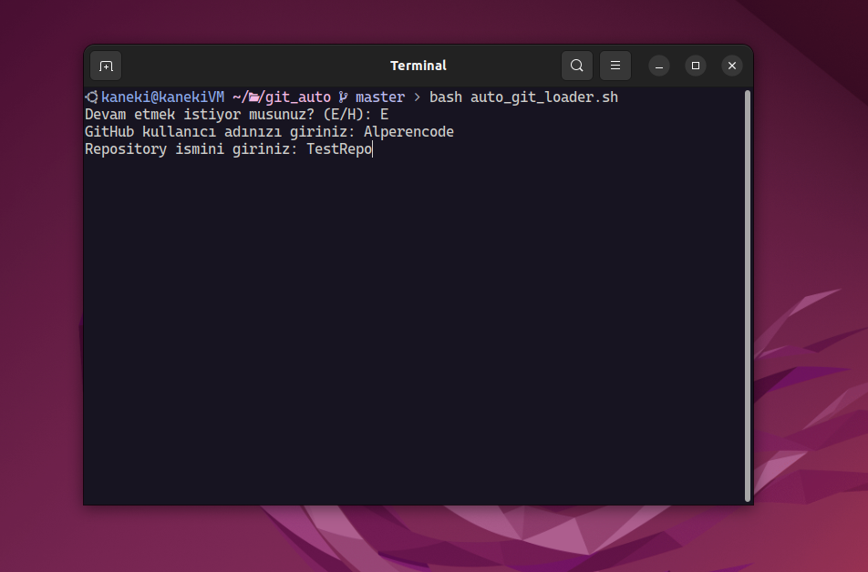
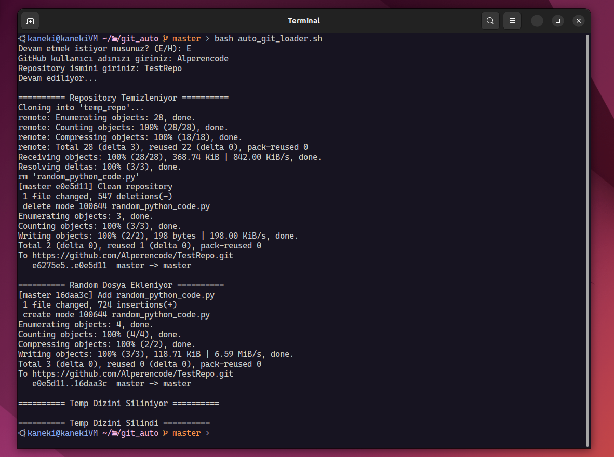

### Bu proje otomatik olan github aktivitesi doldurmanızı sağlar.
---
### Terminalinizde önce bu repoyu clone ediniz.
```bash
git clone  https://github.com/onatkarabulut/auto_git_activity.git
```

---
### Ardından scripti script'in olduğu dizine girip aşağıdaki gibi çalıştırabilirsiniz
```bash
bash auto_git_loader.sh
```


---
- ##### direkt python programını çalıştırabilecek iken script ekleme sebebim scripti home dizininize taşıyıp istediğiniz gibi yönetebilecek olmanızdır.
